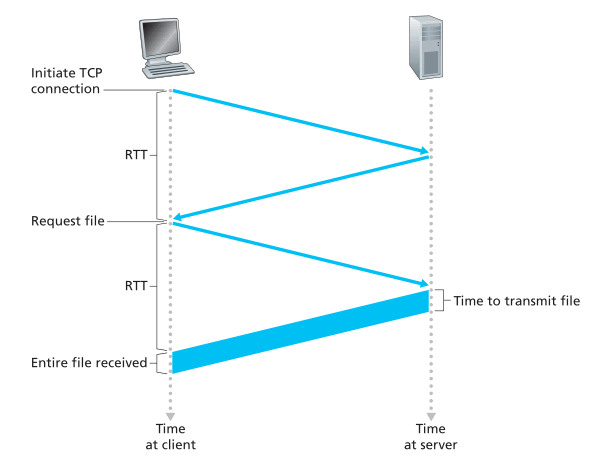
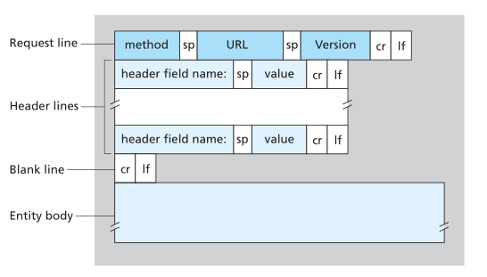
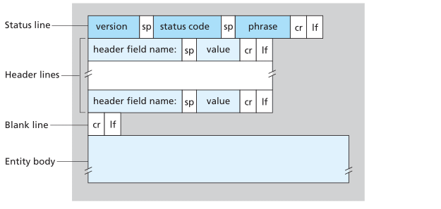
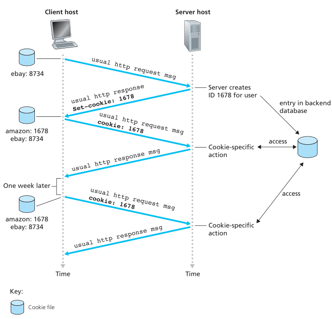

# Application Layer

## Principles of Network Applications

* 应用程序跑在 end system，不在 network core。彼此通过网络交流
* network core 中的设备仅具备低层（<= network layer）功能

### Network Application Architectures

* Two predominant architecture
	* Client-server
	* P2P
* Client-server
	* server
		* **always on**, has a fixed, well-known IP
		* service request from clients
	* client
		* on demand
		* request services of servers
		* **do not communicate with each other directly**, but through servers
	* Examples
		* The Web, FTP, telnet, e-mail
	* Data center hosting large number of hosts that make up a powerful **virtual server**
* P2P
	* intermittently connected hosts i.e. **peers** communicate with each other directly
	* Examples
		* 迅雷，Skype，看看，PPstream
	* Pros
		* Self-scalability
		* cost effective
	* Cons
		* ISP are usually designed for more downstream than upstream traffic 
		* Security risks
		* Users may not have enough incentives to share
* Hybrid
	* Client-server + P2P
	* e.g. server keeps track of IP of peers

### Processes Communicating

* It is **processes** that communicate
	* Run on different **ports**
	* Exchange **messages** across the network

#### Client and Server process

> In the context of a communication session between a pair of processes, the process that **initiates the communication** (that is, initially contacts the other process at the beginning of the session) is labeled as **client**. The process that **waits to be contacted** to begin the session is the **server**

#### The Interface Between the Process and the Computer Network

* Socket
	* like doors of processes
	* software interface between **application layer** and **transport layer**
* API
	* Programming interface of socket
	* Application developer has much control over the application layer, but little control over transport layer
		* Usually they can only choose
			* the transport layer **protocol** to use
			* set a few transport layer **parameters**

#### Addressing Processes
* Needs two pieces of information
	* Address of the host: **IP**
	* Identifier of the receiving process: **port**

### Transport Services Available to Applications

* Deliver the message to th socket of the receiving process
* **Dimensions**
	* Reliable data transfer
	* throughput
	* timing
	* security

#### Reliable data transfer

* Reliable data transfer = garanteed data delivery i.e. delivered **correctly and completely**
* Loss-tolerent applications
	* e.g. Multimedia applications
	* Can tolerate some ammount of data loss
* Other application
	* E-mail
	* File transfer
	* Remote host access
	* financial applications ...

#### Throughput

* The rate at which the sending process can deliver bits to the receiving process
* Can fluctuate with time
* **Bandwidth-sensitive applications**
	* need uaranteed available throughput at some **specified rate**
	* Examples
		* Internet telephony application
		* multimedia application
* **Elastic applications**
	* Examples
		* E-mail
		* File transfer
		* Web transfer

#### Timing

* Delay
* **Interactive real-time applications**
	* Has tight timing constrainsts on data delivery
	* Examples
		* Internet telephony
		* virtual environments
		* Teleconferencing
		* Multiplayer games

#### Security

* **Confidentiality** between processes
	* Encrypt at the sending hosts, decrypt at the receiving host
* **Data integrity**
* End-point **authentication**

### Transport Services Provided by the Internet

#### TCP

* **Connection-oriented**
	* **Hand-shaking**
		* Exchange transport layer control information **before** exchanging application level messages
		* The TCP connection is established after handshaking
	* **Full-duplex**
		* Two processes can send messeges over the connection **at the same time**
	* **Conection tear-down**
		* Four waves
* **Reliable data transfer**
	* Delivers data without error and in the proper order
* **Congestion-control**
	* For the general welfare of the Internet
* **Security**
	* TCP/UDP send unencrypted data
	* **SSL**
		* Secure Sockets Layer
			* Enhancement implemented on **application layer**
			* Provides **encryption, data integrity, end-pont authentication**
			* Intercepts cleartext data sent by applications, encrypt them, then pass down to TCP socket
			* Intercepts data passed up by the TCP socket, decrypts them, then pass up cleartext data to applications through SSL socket

#### UDP
* **Connectionless**
	* No hand-shaking
* **Unreliable data transfer**
	* No guarentee that the messeage will reach the destination
	* May be delivered out of order
* No congestion-control

#### Services not Provided by the Internet Transport Protocols

* Today's Internet transport protocols don't provide **throughput or timing guarantees**
* Applications are usually designed to cope with this
* More applications use TCP
* Loss-tolerent applications, like Internet telephony, may use UDP
* UDP applications may use TCP as backup e.g. to bypass firewalls

### Application-Layer Protocols
* Defines
	* **Types** of messages exchanged
		* e.g. request and response
	* **Syntax** of messages
		* e.g. fields, how fields are delineated
	* **Semantics** of fields
		* meaning of the information in fields
	* **Rules** for determining when and how a process sends and responds to messages
* Some are specified in RFC, therefore in public domain; some are proprietary

## The Web and HTTP

* The Web
	* First application well-known outside academic and research communities
	* Operates **on demand**

### Overview of HTTP

* HyperText Transfer Protocol
* Structure
	* **A client program + a server program**
	* Server is always on
* Basic idea
	* A Web page = A base HTML file + several referenced objects
	* Web browsers implements the client side, Web servers implement the server side.
	* Clients request, server responds
* Uses **TCP** as underlying transport protocol
	* A TCP connection is initiated by the client
	* Messages are send through sockets
	* Advantage: HTTP don't have to worry about data loss/recorver/reorder
* **Stateless**
	* HTTP server maintains no information about the clients

### Non-Persistent and Persistent Connections

### Non-Persistent HTTP
* Each request/response pair is sent over a **seperate** TCP connection i.e. TCP connection is closed after the server sends each object
* Example
	1. HTTP client **initiates a TCP connection** to the server
	2. HTTP client **sends an HTTP request** via the socket
	3. HTTP server **receives the request**, **retrieves** the object, **encapsulates** it in a HTTP response, **sends** it back via its socket
	4. HTTP server tell the TCP to **close the connection** (TCP may delay until it is sure that the data is delivered intact)
	5. HTTP client **receives** the response, TCP connection is **closed**
	6. If there are more object referenced by the previous object, repeat 1 ~ 5
* **Parallelism**
	* The client can initiate multiple TCP connections at the same time
	* shorten the response time
* **Calculation**
	* RTT: round-trip time
		* The time it takes for a **packet** to travel **from client to server and then back to server**
	* Each non-persistent req/res needs **2 RTT**
		* First two step of 3-way handshakes of TCP take 1 RTT
		* Last step of handshakes and the response from server take 1 RTT
		
		* 

### Persistent HTTP
* Req/res sent over the **same** TCP connection i.e. the TCP connection won't be closed after response is sent
* Disadvantage of non-persistent HTTP
	* Buffers, data ... overhead for establishing a new TCP connection
	* 2RTT for each object
* Persistent HTTP
	* **leaves the TCP connection open** after sending a response
* Implemented using the **Connection** header field(use value `keep-alive` to leave the connection open, `close` to close the connection)

### HTTP Message Format

* ASCII text
* use `\r\n`

#### HTTP Request Message
* Format
	* 
* **GET** request usually doesn't have body, the data is in the URL (query string)
* **POST** are usually used to submit a form. The data is in the request body
* **HEAD** is similar to GET, but it doesn't need a response. Usually used for debugging
* **PUT** is used for put/upload a object to a specific path on the server
* **DELETE** is used to delete an object

#### HTTP Response Message
* Format
	* 
	* Notice the first line -- **status line**
* Status code: check RFC 2616

### User-Server Interaction: Cookies
* **Components**
	* `Set-cookie` in response header line
	* `cookie` in request header line
	* Cookie file kept on the client
	* Backend database on the server
* The browser keeps cookies for each hostname. When the cookies are set, it will include the cookies in **every request** to this host.
* The server use the cookie and its database to identify users.
* Cookies create a **user session layer** on top of the stateless HTTP -> stateful

### Web Caching
* **Web cache/proxy server**
	* A network entity that satisfies HTTP requests on behalf of the origin web server
	* Keep copies of recently requested objects in its storage
	* Both a client and a server
	* Usually installed by the ISP
* **How it works**
	1. The browser establishes a TCP connection **to the Web chace**, sends a requst to it
	2. The cache checks its storage for the request, returns objects if they are in the caches
	3. If the object is not in the cache, it opens a TCP connection to the origin web server, and sends an HTTP request to it.
	4. The server sends a response to the web cache
	5. The web cache receives the object, stores it in the storage if necessary, and sends a copy to the client.
* **Adavantages**
	* Reduce response time
	* Reduce traffic of the access link
	* Reduce Web traffic in the Internet as a whole
* **Calculations**
	* **LAN delay**
		* From the client to the LAN side router of the access link
		* Traffic intensity: (req/sec * size/req) / (LAN transimssion rate)
		* Since the LAN transmission rate is typically very high, the traffic intensity << 1, can be neglected
	* **Access delay**
		* From the **LAN side** router of the access link to the **Internet side** router of the access link
		* Same formula as LAN delay, but the transmission rate of the access link is usually not that high, so traffic intensity may be ~ 1
	* **Internet delay**
		* The time from when the Internet side of the **access link** forwards a request to when it receives the response
	* **Total response time**
		* From when the client requests the object to when it receives the response
		* Total response time = LAN delay + access delay + Internet delay
		* Notice: delay **is not proportional** to traffic intensity, when intensity ~ 1, the delay can grow without bounds
	* **Upgrade access link v.s. install a web cache**:
		* Cache is cheaper and effective
		* Total response time = (hit rate) * (LAN delay) + (1 - hit rate) (LAN delay + access delay + Internet delay)
		* The traffic intensity on the access link can be greatly reduced
* **CDN**
	* Content Distribution Networks
	* Installed by companies through out the Internet to localize the traffic

### Conditional GET
* **Problem**
	* Cache can become stale
	* Needs to verify the cache is up-to-date
* **Components**
	* `GET` and `If-Modified-Since:` in request
	* `Last-Modified` and status code of response
* **How it works**
	1. Client sends a request via the cache
	2. The server send a response back to the cache, the cache stores the object **along with the** `Last-Modified` date
	3. The Client sends a request again
	4. The cache issues a conditional GET by using the stored date as `If-Modified-Since` in the request
	5. The server sends response with either `304 Not Modified` + no object or a new `Last-Modified` + a new object
	6. The cache sends back its own copy or the new object back to client

## File Transfer: FTP

### Overview

### FTP Commands and Replies

## Electronic Mail in the Internet

### SMTP

### Comparison with HTTP

### Mail Message Formats

### Mail Access Protocols

#### POP3

#### IMAP

#### Web-Based E-Mail

## DNS -- The Internet's Directory Service

### Services Provided by DNS

### Overview of How DNS Works

#### Distributed, Hierarchical Database

#### DNS Caching

### DNS Records and Messages

#### DNS Messages

#### Inserting Records into the DNS Database

### DNS Vuneralbilities

## Peer-to-Peer Applications

### P2P File Distribution

#### Scalability of P2P Architectures

#### BitTorrent

### Distributed Hash Tables

#### Circular DHT

#### Peer Churn