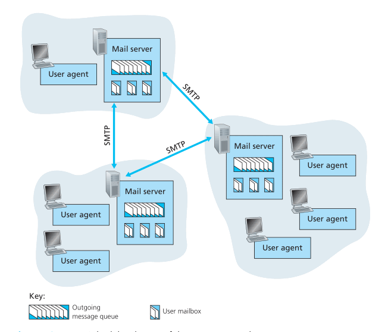
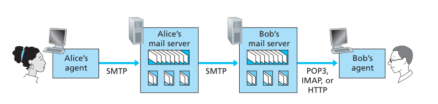

# Application Layer

## Principles of Network Applications

* 应用程序跑在 end system，不在 network core。彼此通过网络交流
* network core 中的设备仅具备低层（<= network layer）功能

### Network Application Architectures

* Two predominant architecture
	* Client-server
	* P2P
* Client-server
	* server
		* **always on**, has a fixed, well-known IP
		* service request from clients
	* client
		* on demand
		* request services of servers
		* **do not communicate with each other directly**, but through servers
	* Examples
		* The Web, FTP, telnet, e-mail
	* Data center hosting large number of hosts that make up a powerful **virtual server**
* P2P
	* intermittently connected hosts i.e. **peers** communicate with each other directly
	* Examples
		* 迅雷，Skype，看看，PPstream
	* Pros
		* Self-scalability
		* cost effective
	* Cons
		* ISP are usually designed for more downstream than upstream traffic 
		* Security risks
		* Users may not have enough incentives to share
* Hybrid
	* Client-server + P2P
	* e.g. server keeps track of IP of peers

### Processes Communicating

* It is **processes** that communicate
	* Run on different **ports**
	* Exchange **messages** across the network

#### Client and Server process

> In the context of a communication session between a pair of processes, the process that **initiates the communication** (that is, initially contacts the other process at the beginning of the session) is labeled as **client**. The process that **waits to be contacted** to begin the session is the **server**

#### The Interface Between the Process and the Computer Network

* Socket
	* like doors of processes
	* software interface between **application layer** and **transport layer**
* API
	* Programming interface of socket
	* Application developer has much control over the application layer, but little control over transport layer
		* Usually they can only choose
			* the transport layer **protocol** to use
			* set a few transport layer **parameters**

#### Addressing Processes
* Needs two pieces of information
	* Address of the host: **IP**
	* Identifier of the receiving process: **port**

### Transport Services Available to Applications

* Deliver the message to th socket of the receiving process
* **Dimensions**
	* Reliable data transfer
	* throughput
	* timing
	* security

#### Reliable data transfer

* Reliable data transfer = garanteed data delivery i.e. delivered **correctly and completely**
* Loss-tolerent applications
	* e.g. Multimedia applications
	* Can tolerate some ammount of data loss
* Other application
	* E-mail
	* File transfer
	* Remote host access
	* financial applications ...

#### Throughput

* The rate at which the sending process can deliver bits to the receiving process
* Can fluctuate with time
* **Bandwidth-sensitive applications**
	* need uaranteed available throughput at some **specified rate**
	* Examples
		* Internet telephony application
		* multimedia application
* **Elastic applications**
	* Examples
		* E-mail
		* File transfer
		* Web transfer

#### Timing

* Delay
* **Interactive real-time applications**
	* Has tight timing constrainsts on data delivery
	* Examples
		* Internet telephony
		* virtual environments
		* Teleconferencing
		* Multiplayer games

#### Security

* **Confidentiality** between processes
	* Encrypt at the sending hosts, decrypt at the receiving host
* **Data integrity**
* End-point **authentication**

### Transport Services Provided by the Internet

#### TCP

* **Connection-oriented**
	* **Hand-shaking**
		* Exchange transport layer control information **before** exchanging application level messages
		* The TCP connection is established after handshaking
	* **Full-duplex**
		* Two processes can send messeges over the connection **at the same time**
	* **Conection tear-down**
		* Four waves
* **Reliable data transfer**
	* Delivers data without error and in the proper order
* **Congestion-control**
	* For the general welfare of the Internet
* **Security**
	* TCP/UDP send unencrypted data
	* **SSL**
		* Secure Sockets Layer
			* Enhancement implemented on **application layer**
			* Provides **encryption, data integrity, end-pont authentication**
			* Intercepts cleartext data sent by applications, encrypt them, then pass down to TCP socket
			* Intercepts data passed up by the TCP socket, decrypts them, then pass up cleartext data to applications through SSL socket

#### UDP
* **Connectionless**
	* No hand-shaking
* **Unreliable data transfer**
	* No guarentee that the messeage will reach the destination
	* May be delivered out of order
* No congestion-control

#### Services not Provided by the Internet Transport Protocols

* Today's Internet transport protocols don't provide **throughput or timing guarantees**
* Applications are usually designed to cope with this
* More applications use TCP
* Loss-tolerent applications, like Internet telephony, may use UDP
* UDP applications may use TCP as backup e.g. to bypass firewalls

### Application-Layer Protocols
* Defines
	* **Types** of messages exchanged
		* e.g. request and response
	* **Syntax** of messages
		* e.g. fields, how fields are delineated
	* **Semantics** of fields
		* meaning of the information in fields
	* **Rules** for determining when and how a process sends and responds to messages
* Some are specified in RFC, therefore in public domain; some are proprietary

## The Web and HTTP

* The Web
	* First application well-known outside academic and research communities
	* Operates **on demand**

### Overview of HTTP

* HyperText Transfer Protocol
* Structure
	* **A client program + a server program**
	* Server is always on
* Basic idea
	* A Web page = A base HTML file + several referenced objects
	* Web browsers implements the client side, Web servers implement the server side.
	* Clients request, server responds
* Uses **TCP** as underlying transport protocol
	* A TCP connection is initiated by the client
	* Messages are send through sockets
	* Advantage: HTTP don't have to worry about data loss/recorver/reorder
* **Stateless**
	* HTTP server maintains no information about the clients

### Non-Persistent and Persistent Connections

### Non-Persistent HTTP
* Each request/response pair is sent over a **seperate** TCP connection i.e. TCP connection is closed after the server sends each object
* Example
	1. HTTP client **initiates a TCP connection** to the server
	2. HTTP client **sends an HTTP request** via the socket
	3. HTTP server **receives the request**, **retrieves** the object, **encapsulates** it in a HTTP response, **sends** it back via its socket
	4. HTTP server tell the TCP to **close the connection** (TCP may delay until it is sure that the data is delivered intact)
	5. HTTP client **receives** the response, TCP connection is **closed**
	6. If there are more object referenced by the previous object, repeat 1 ~ 5
* **Parallelism**
	* The client can initiate multiple TCP connections at the same time
	* shorten the response time
* **Calculation**
	* RTT: round-trip time
		* The time it takes for a **packet** to travel **from client to server and then back to server**
	* Each non-persistent req/res needs **2 RTT**
		* First two step of 3-way handshakes of TCP take 1 RTT
		* Last step of handshakes and the response from server take 1 RTT
		
		* 

### Persistent HTTP
* Req/res sent over the **same** TCP connection i.e. the TCP connection won't be closed after response is sent
* Disadvantage of non-persistent HTTP
	* Buffers, data ... overhead for establishing a new TCP connection
	* 2RTT for each object
* Persistent HTTP
	* **leaves the TCP connection open** after sending a response
* Implemented using the **Connection** header field(use value `keep-alive` to leave the connection open, `close` to close the connection)

### HTTP Message Format

* ASCII text
* use `\r\n`

#### HTTP Request Message
* Format
	* 
* **GET** request usually doesn't have body, the data is in the URL (query string)
* **POST** are usually used to submit a form. The data is in the request body
* **HEAD** is similar to GET, but it doesn't need a response. Usually used for debugging
* **PUT** is used for put/upload a object to a specific path on the server
* **DELETE** is used to delete an object

#### HTTP Response Message
* Format
	* 
	* Notice the first line -- **status line**
* Status code: check RFC 2616

### User-Server Interaction: Cookies
* **Components**
	* `Set-cookie` in response header line
	* `cookie` in request header line
	* Cookie file kept on the client
	* Backend database on the server
* The browser keeps cookies for each hostname. When the cookies are set, it will include the cookies in **every request** to this host.
* The server use the cookie and its database to identify users.
* Cookies create a **user session layer** on top of the stateless HTTP -> stateful

### Web Caching
* **Web cache/proxy server**
	* A network entity that satisfies HTTP requests on behalf of the origin web server
	* Keep copies of recently requested objects in its storage
	* Both a client and a server
	* Usually installed by the ISP
* **How it works**
	1. The browser establishes a TCP connection **to the Web chace**, sends a requst to it
	2. The cache checks its storage for the request, returns objects if they are in the caches
	3. If the object is not in the cache, it opens a TCP connection to the origin web server, and sends an HTTP request to it.
	4. The server sends a response to the web cache
	5. The web cache receives the object, stores it in the storage if necessary, and sends a copy to the client.
* **Adavantages**
	* Reduce response time
	* Reduce traffic of the access link
	* Reduce Web traffic in the Internet as a whole
* **Calculations**
	* **LAN delay**
		* From the client to the LAN side router of the access link
		* Traffic intensity: (req/sec * size/req) / (LAN transimssion rate)
		* Since the LAN transmission rate is typically very high, the traffic intensity << 1, can be neglected
	* **Access delay**
		* From the **LAN side** router of the access link to the **Internet side** router of the access link
		* Same formula as LAN delay, but the transmission rate of the access link is usually not that high, so traffic intensity may be ~ 1
	* **Internet delay**
		* The time from when the Internet side of the **access link** forwards a request to when it receives the response
	* **Total response time**
		* From when the client requests the object to when it receives the response
		* Total response time = LAN delay + access delay + Internet delay
		* Notice: delay **is not proportional** to traffic intensity, when intensity ~ 1, the delay can grow without bounds
	* **Upgrade access link v.s. install a web cache**:
		* Cache is cheaper and effective
		* Total response time = (hit rate) * (LAN delay) + (1 - hit rate) (LAN delay + access delay + Internet delay)
		* The traffic intensity on the access link can be greatly reduced
* **CDN**
	* Content Distribution Networks
	* Installed by companies through out the Internet to localize the traffic

### Conditional GET
* **Problem**
	* Cache can become stale
	* Needs to verify the cache is up-to-date
* **Components**
	* `GET` and `If-Modified-Since:` in request
	* `Last-Modified` and status code of response
* **How it works**
	1. Client sends a request via the cache
	2. The server send a response back to the cache, the cache stores the object **along with the** `Last-Modified` date
	3. The Client sends a request again
	4. The cache issues a conditional GET by using the stored date as `If-Modified-Since` in the request
	5. The server sends response with either `304 Not Modified` + no object or a new `Last-Modified` + a new object
	6. The cache sends back its own copy or the new object back to client

## File Transfer: FTP
### Overview

* HTTP 与 FTP 的区别
	* FTP 使用两个 TCP 连接：一个 **control connection**，一个**data connection**
		* control connection 用于发送控制信息
		* data connection 用于传输数据
		* 此为 **out-of-band**，HTTP 将控制信息与数据一同传输所以叫 **in-band**
    * FTP 为 stateful，HTTP为 stateless
* How it works
	1. FTP client 首先按给定的 host + port（默认21） 向 server 发起 TCP 连接（control connection）
	2. FTP client 通过建立的 control connection 发送用户名和密码进行登录
	3. FTP client 发送切换远程目录的命令, etc.
	4. FTP client 发送文件传输命令
	5. FTP server 向 client 发起 TCP data connection，传输数据（或者 client 发起 data connection 上传数据）
	6. 如果需要传输其他数据，再开一个新的 data connection
* 注意点
	* control connection 全程 open
	* data connection 为 non-persistent （开一个用一个）
	* FTP server 需要保存 state -- 登录信息，当前目录 etc.，所以 FTP 是 stateful 的

### FTP Commands and Replies
* 格式
    * 使用 7-bit ASCII 传输，可读
    * 使用`\r\n`换行
    * command 4个大写字母加参数
    * reply 为 3 个数字，可能带有额外message，类似 HTTP status code
* command 例子
	* `USER username` 发送用户名
    * `PASS password` 发送密码
    * `LIST` 相当于 `ls`
    * `RETR filename` 下载文件到当前文件夹
    * `STOR filename` 上传文件
* reply 例子
	* `331 Username OK, password required`
	* `125 Data connection already open; transfer starting`
	* `425 Can't open data connection`
	* `452 Error writing file`
* 更多参见[RFC 959](https://www.ietf.org/rfc/rfc959.txt)

## Electronic Mail in the Internet

* 使用 mailbox 存储邮件
* 使用 message queue 在 server 之间发送邮件与重试

### SMTP

* 简介
    * 使用 TCP
    * mail server 即可充当 server 也可充当 client
    * [RFC 5321](https://tools.ietf.org/html/rfc5321)
* 限制
	* 必须用 7-bit ASCII 传输数据 -- 不方便传输多媒体，需要二进制 -> ASCII -> 二进制转换
* 举例
	1. A 向一个 user agent 提供 B 的地址（默认端口 25），将写好的信交给 UA
	2. UA 发送信息到 A 的 mail server，信息进入 message queue
	3. A 的 mail server 上的 SMTP client 向 B 的 mail server 上的 SMTP server 发起 TCP 连接
	4. 两个 mail server 进行 application-layer 的握手，声明收件方的邮件地址；SMTP client 发送信息到 SMTP server
	5. B 的 mail server 收到信息，放入 B 的mailbox
	6. B 打开自己的 UA，从自己的 mail server 获取信息

* 注意点
	* SMTP 一般不会有间接的 mail server，两个 mail server 直接通信，收信方的 mail server 挂了就收不到了
	* SMTP 使用 persistent connection -- client 不断向 server 发送邮件（可能通往不同地址）直到发送完毕
	

### Comparison with HTTP

* 不同点
	1. HTTP 在 web server 与 web client 之间传输文件；SMTP 在 mail server 与 mail server 之间传输文件
	2. HTTP 主要是 **pull protocol**，由文件**接收方**发起 TCP 连接；SMTP 主要是 **push protocol**，由**发件方**发起 TCP 连接
	3. HTTP 对数据编码没有要求，SMTP 必须为 7-bit ASCII 编码
	4. HTTP 将多个不同的 object 封装在不同的 HTTP 响应里，SMTP 将所有 object 放在一个信息里
* 相同点
	1. HTTP 与 SMTP 均可使用 persistent connection

### Mail Message Formats
* 注意前面提到的格式是**protocol**用的，这里的格式是邮件本身的格式
* header 必须有`From:`和`To:`，可选`Subject:`及其他，用`\r\n`分割
* header 和 body 之间有一个空行

### Mail Access Protocols

* 定义用户如何访问 mail server
* 早年用户需要登录到 mail server，使用运行在 mail server 上的 reader 来读信
* 如今用户使用运行在自己 end system 上的 UA 连接到一个 always on 的 mail server 来读信
* 发件方通过 UA 和自己的 mail server 间接发信
	* 一般不让用户的 UA 直接用 SMTP 向收件方的 mail server 发信
	* 通过另一个 mail server 来发送可以不断重试
* 收件方使用 UA 读信
	* UA 用的不是SMTP，因为 SMPT 是个 push protocol，不适合用于下载
	* 使用 **Mail Access Protocols** e.g. POP3, IMAP 从 mail server 拉取信息

#### POP3

* RFC 1939
* How it works
	1. UA 向 mail server 发起 TCP 连接 (默认 port 110)
	2. Authorization： UA **明文** 发送用户名和密码
		* `user <username>`
		* `pass <password>`
		
	3. Transaction: UA 下载邮件，标记/取消标记要删除的邮件，获取其他信息
		* download-and-delete
			* `list` -> `retr` -> `dele`
		* download-and-keep
			* `dele` is optional
	4. Update: UA 发送 `quit` 结束会话，mail server 进行更新
* 结构
	* UA 发送 command
	* mail server 发送 reply
		* `+OK` （可能伴随着数据）
		* `-ERR`
* 特点
	* POP3 server maintains **states** for clients
	* State does not cross **different sessions** -> simple to implement
	* 经过 authorization 之后，只有 `list`，`retr`，`dele` 和 `quit` 四个命令

#### IMAP

* RFC 3501
* POP3 的缺点
	* 没有本地目录
	* 没有跨 session 信息
	* 明文
* Basic idea
	* 每封邮件有对应的文件夹
	* 默认发送到收件方的 INBOX 文件夹
	* 用户可以创建文件夹，移动邮件，搜索邮件
* 特点
	* 跨 session
	* 可以只获取邮件的一部分 e.g. header，正文，附件

#### Web-Based E-Mail

* Introduced by Hotmail
* 使用浏览器作为 UA，HTTP(S) 传输 UA 及 mail server 间的信息
* mail server 之间依然用 SMTP 通信

## DNS -- The Internet's Directory Service

* Hostname 就像地名，IP 就像邮政地址
* IP is hierarchical: more specific location info from left to right

### Services Provided by DNS

* Domain Name System
	* 将 hostname 翻译为 IP
* 包括
	1. Distributed **database** implemented in a hierarchy of **DNS servers**
    2. Application-layer **protocol** to query the database
* DNS server 通常为运行 Berkeley Internet Name Domain(BIND) 的 UNIX 机器，使用**UDP**，默认端口 53
* 常被其他 application layer protocol 使用
* 举例：浏览器发起 HTTP 连接
	1. 浏览器从 URL 里提取出 hostname（e.g. `www.example.com`），交给同一台机器上运行的 DNS client
	2. DNS client 向 DNS server 发送包括这个 hostname 的查询
	3. DNS client 收到回复，里面有对应的 IP 地址
	4. DNS 将 IP 返回给浏览器
	5. 浏览器使用这个 IP 向 HTTP server 的 80 端口发起 TCP连接
* DNS 提供的其他服务
	* Host aliasing
    	* 1 host name -> multiple alias
    	* e.g. `b.com` and `www.b.com` = `relay.a.b.com`
    	* 此时叫最终的那个复杂的 hostname **canonical hostname**，其他几个 alias 方便记忆
    	* DNS 能够将 alias 翻译为 canonical hostname
	* Mail server aliasing
		* DNS 能够将 mail server 简单易记的 alias 翻译为 canonical hostname
		* DNS 可以让 web server 和 mail server 拥有同一个 alias （映射到不同的 canonical hostname）
			* e.g. 你可以用浏览器访问 `a.com`，也可以发送邮件到 `xx@a.com`
			* DNS 会对两种访问获取不同的 canonical hostname（比如前者为 `web.a.com`，后者为`mail.a.com`）
	* Load distribution
		* 大型网站拥有多个服务器，每台有自己的IP
		* DNS 将一个 hostname 映射到 一个IP的**集合**
		* 接到对于一个 hostname 的查询，DNS 会返回整个集合，但会根据负载调整排序
		* DNS client 通常选择返回的集合的第一条 IP（通常对应最有空的或者最合适的那台机器）

### Overview of How DNS Works

#### Distributed, Hierarchical Database

#### DNS Caching

### DNS Records and Messages

#### DNS Messages

#### Inserting Records into the DNS Database

### DNS Vuneralbilities

## Peer-to-Peer Applications

### P2P File Distribution

#### Scalability of P2P Architectures

#### BitTorrent

### Distributed Hash Tables

#### Circular DHT

#### Peer Churn