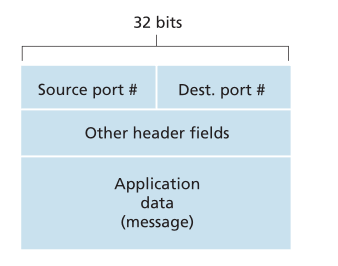
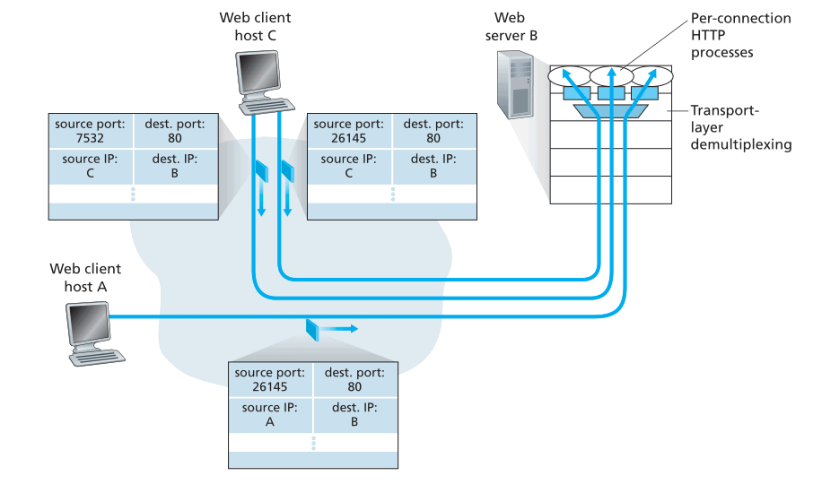

# Transport Layer

## Introduction and Transport-Layer Services

* logical communication
	* as if the hosts were directly connected
* what it does on the sending side
	* **break** the application-layer messages into chunks
	* **encapsulate** the chunks into network-layer segments
	* **pass** the segment to the network layer
* routers
	* routers **only act on network layer fields** of the datagram
	* ignorant of the info added by transport layer

### Relationship between transport and network layers

* transport-layer and network-layer
	* tranport layer provides logical connection between **process on hosts**
	* network-layer provides logical connection between **hosts**
* 类比
	* application messages = 信封里的信
	* processes = 大院里的人
	* hosts = 大院
	* transport-layer protocol = 值班室大爷
	* network-layer protocol = 邮政
* Service of transport-layer protocol is **constrianed** by what network-layer protocol provides
* Transport layer protocol can, however, add something else (within the constraint) e.g. error checking, encryption...

### Overview of the Transport Layer in the Internet

* **UDP**
	* User Datagram Protocol
	* Unreliable, connectionless service to applications
* **TCP**
	* Tranmission Control Protocol
	* Reliable, connection-oriented service to applications
* IP datagram, TCP/UDP segment (though some might use UDP *datagram*)
* **IP**
	* Internet Protocol
	* Provide logical communication between **hosts**
	* **best effort delivery service**
		* Best effort to deliver, but **no guarantees**
		* Not on delivery, order, integrity...
	* **unreliable service**
	* each host has an IP address
* **Responsiblity of UDP**
	1. Transport layer **multiplexing and demultiplexing**
		* Extend IP's **host-to-host** delivery service to **process-to-process** delivery
    2. **Integrity checking**
    	* Include error-detection fields in segment headers
* **Responsiblity of TCP**
	* What UDP offers
	* **Reliable data transfer**
		* flow control, sequence number, acknowledgements,  timers
		* Make sure the data is delivered **correctly and in order**
    * **Congestion Control**
    	* Not for the invoking application, but for the Internet as a whole
    	* Prevent any TCP connection swamping the links and routers
    	* Regulate the sending rate (UDP don't do that)

## Multiplexing and Demultiplexing

* How it's done
	* Each process can have one or more sockets
	* Transport layer protocol deliver data to the **intermediary sockets** instead of to the processes directly
* **Demultiplexing**
    * **What it does**
        * **Check** the fields in the segment
        * **Identify** the receving socket
        * **Direct** the segment to the socket
    * **UDP Implementation**
    	* Each socket is assigned a port number as identifier
* **Multiplexing**
    * **What it does**
        * **Gather** the data to send from different processes
        * **Encapsulate** the data into segments
        * **Pass** the segments to the network layer
    * **Requirement**
    	* Sockets need to have **unique identifiers**
    	* Segments should have **special fields** to indicate the destination socket
    		* source port number field
    		* destination port number field
    		* port numbers between 0 ~ 1023 are **well-known port numbers**
    		

### Connectionless multiplexing and demultiplexing

* Assignment
    * Usually when creating a socket, **assign** a port number between 1024 ~ 65535
    * If it is for a **server side** application, might be a well-known port number
    * Clients use automatically assigned port numbers, servers use specific port numbers
* How it works
	1. transport layer in A create a segment with the data from a process, source port, destination port and other headers, pass it to the network layer
	2. network layer encapsulates the segment in an IP datagram, makes best effort to deliver it
	3. transport layer in B checks the destination port in the received segment, delivers it to the corresponding socket
* Notice
	* A UDP socket is **fully identified** by `(destination IP, destniation port)`
	* If two UDP segments arrive with **different source IP/port** and the same destination IP/port, they will go to the **same socket**
	* But it still needs the source IP/port to send replies, just don't use it as identifier

### Connection-oriented multiplexing and demultiplexing

* Difference from UDP
	* TCP socket is identified by `(source IP, source port, destination IP, destination port)`
	* **All four** values will be used to demultiplex the segment to a socket(instead of only the latter two)
	* Same destination + different source = different socket (UDP won't)
* How it works
	1. TCP Server opens a **welcoming socket**
	2. TCP client **create a socket** (and allocate a port), sends a **connection establishment request**  with the src and dest port
	3. TCP server receives the segment, **create a socket** for this client (identified by `src IP, src port, dest IP, dest port`)
	4. Every subsequent segment with the same (identified by `src IP, src port, dest IP, dest port`) will be demultiplexed to this socket

### Web servers and TCP

* HTTP server 默认使用 80 端口，因而连接要靠 source 的 IP 和 port 区分
* 不一定会为每个连接创建一个新进程，可能是一个新线程 + 一个新 socket
	* 所以一个进程（一个port）可能对应多个不同的 socket
	* 如果是 persistent HTTP，整个过程使用同一个 socket
	* 如果是 non-persistent HTTP，每次 req/res 都会创建/关闭一个新 socket（如果是线程池，可能不用关闭，但每次还是对应到不同 socket）

### Port scanning

* 一些常见的应用会使用固定的默认端口
* 网管通过扫描端口可以得知用户都在运行什么网络程序
* 攻击者通过扫描端口可以得知对方运行了什么程序，配合已知的一些程序的漏洞可以进行攻击
* `nmap`
	* TCP: 寻找允许建立 TCP 连接的端口
	* UDP: 寻找会回复 UDP segment 的端口

## Connectionless Transport: UDP

* 只提供一个 transport-layer protocol 提供的最基本的功能
	* multiplex，demultiplex，error-checking
	* 从 application 获取信息，添加 src/dest IP 和 port，error-checking field，传给 network-layer
	* 没有握手，所以 connectionless
* 举例：DNS
	* 发送然后等待
	* 如果收不到回复，重新发送或者告知发起查询的应用
* **使用 UDP 的原因**
	* Finer application-level control over **what data is sent, and when**
		* UDP 获取信息后立刻封装发送，没有多余的延迟
		* TCP 在收不到回复时会不断重新发送，占用发送新信息的资源
		* Real-time application
			* 通常需要一个 minimum sending rate，且不希望信息发送被过度延迟 （不能无限重试）
			* 能够忍受一定的数据丢失
			* TCP 的 congestion control 碍事
			* 可以自己添加部分类似 TCP 的功能，但不需要受限于 TCP 的 congestion control，而且可以定制
    * No connection establishment
    	* DNS
    		* 用 UDP 不需要等待建立连接，速度更快
    * No connection state
    	* UDP does not maintain connection state or track parameters
    	* 能够支持更多 client
    * Small packet header overhead
    	* TCP 的 header 有 20 byte，UDP 只有 8 byte
* 应用场景
	* RIP routing table update
	* SNMP network management
	* real-time apps e.g. skype
* 注意
	* 一些使用 UDP 的应用会有 TCP backup
		* 丢包率低时用 TCP 收益大
		* 部分机构会为安全屏蔽 UDP
* 缺点
	* No congestion control
		* 引起网络拥堵 -- UDP 丢包，还能挤掉 TCP

### UDP Segment Structure

* RFC 768
* header
	* src port, dest port
	* length：因为数据长度不定
	* checksum：探测数据是否有变化（实际中计算的输入还包括了 IP header）

### UDP Checksum

* 计算
    * 将输入划分为 16-bit words（不够在后面补零）
    * 将每个 16-bit words 相加，MSB 进位移到最后一位再加（相当于丢弃进位，然后加1）
    * 将得到的和取反，就是 checksum
* 检验
	* 再次计算 checksum，输入包括传输过来的 cheksum （如果没有变化就是原数据 checksum + 它的反码）
	* 如果没有变化，得到的是 16 个 1
* 为什么 UDP 提供 checksum
	* 不是所有 link-layer protocol 都提供 error-checking
	* 保存在 router 的内存时也可能发生变化
	* 没有 link-by-link reliability 也没有 in-memory error detection，UDP 只有在 end-end 提供 error detection （**end-end principle**）
* 注意
	* UDP 只检查错误，不提供恢复服务
	* 可能直接丢弃发生错误的 segment，或者传给上层但带有 warning

## Principles of Reliable Data Transfer

* responsibility of a reliable data transfer protocol
	* deliver data without error, loss, and in order
* unidirectional data transfer
	* Only one side is sending data
* bidirectional data transfer
	* Both send data, more complex
* data packet + control packet

### Building a Reliable Data Transfer Protocol

#### Over a perfectly reliable channel: rdt 1.0

#### With bit erros: rdt 2.0

#### Lossy channel + bit errors: rdt 3.0

### Pipelined Reliable Data Transfer Protocols

### Go-Back-N(GBN)

### Selective Repeat (SR)

## Connection-Oriented Transport: TCP

### The TCP connection

### TCP Segment Structure

#### Sequence numbers and acknowledgesment numbers

#### Telnet: A case study for sequence and acknowledgment numbers

### Roud-Trip Time Estimation and Timeout

#### Estimating the Round-Trip Time

#### Setting and Managing the Retransmission Timeout Interval

### Reliable Data Transfer

#### Scenarios

#### Doubling the Timeout Interval

#### Fast Retransmit

#### Go-Back-N or Selective Repeat?

### Flow Control

### TCP Connection Management

### SYN Flood Attack

## Principles of Congestion Control

### The Causes and the Costs of Congestion

#### Scenario 1: Two senders, a Router with Infinite Buffers

#### Scenario 2: Two senders, a Router with Finite Buffers

#### Scenario 3: Four senders, Routers with Finite Buffers, Multihop Paths

### Approaches to Congestion Control

### Network-Assisted Congestion-Control Example: ATM ABR Congestion Control

## TCP Congestion Control

#### Slow start

#### Congestion avoidance

#### Fast recovery

#### TCP Congestion Control: retrospective

#### Macroscopic description of TCP Throughput

#### TCP over high-bandwith paths

### Fairness

#### Fairness and UDP

#### Fairness and Parallel TCP Connections

