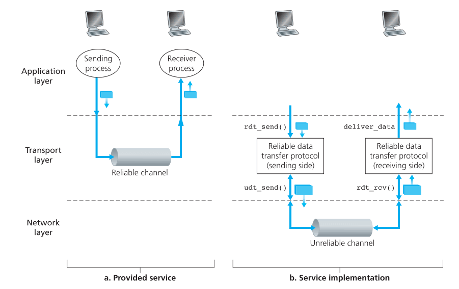

# Transport Layer

## Introduction and Transport-Layer Services

* logical communication
	* as if the hosts were directly connected
* what it does on the sending side
	* **break** the application-layer messages into chunks
	* **encapsulate** the chunks into network-layer segments
	* **pass** the segment to the network layer
* routers
	* routers **only act on network layer fields** of the datagram
	* ignorant of the info added by transport layer

### Relationship between transport and network layers

* transport-layer and network-layer
	* tranport layer provides logical connection between **process on hosts**
	* network-layer provides logical connection between **hosts**
* 类比
	* application messages = 信封里的信
	* processes = 大院里的人
	* hosts = 大院
	* transport-layer protocol = 值班室大爷
	* network-layer protocol = 邮政
* Service of transport-layer protocol is **constrianed** by what network-layer protocol provides
* Transport layer protocol can, however, add something else (within the constraint) e.g. error checking, encryption...

### Overview of the Transport Layer in the Internet

* **UDP**
	* User Datagram Protocol
	* Unreliable, connectionless service to applications
* **TCP**
	* Tranmission Control Protocol
	* Reliable, connection-oriented service to applications
* IP datagram, TCP/UDP segment (though some might use UDP *datagram*)
* **IP**
	* Internet Protocol
	* Provide logical communication between **hosts**
	* **best effort delivery service**
		* Best effort to deliver, but **no guarantees**
		* Not on delivery, order, integrity...
	* **unreliable service**
	* each host has an IP address
* **Responsiblity of UDP**
	1. Transport layer **multiplexing and demultiplexing**
		* Extend IP's **host-to-host** delivery service to **process-to-process** delivery
    2. **Integrity checking**
    	* Include error-detection fields in segment headers
* **Responsiblity of TCP**
	* What UDP offers
	* **Reliable data transfer**
		* flow control, sequence number, acknowledgements,  timers
		* Make sure the data is delivered **correctly and in order**
    * **Congestion Control**
    	* Not for the invoking application, but for the Internet as a whole
    	* Prevent any TCP connection swamping the links and routers
    	* Regulate the sending rate (UDP don't do that)

## Multiplexing and Demultiplexing

* How it's done
	* Each process can have one or more sockets
	* Transport layer protocol deliver data to the **intermediary sockets** instead of to the processes directly
* **Demultiplexing**
    * **What it does**
        * **Check** the fields in the segment
        * **Identify** the receving socket
        * **Direct** the segment to the socket
    * **UDP Implementation**
    	* Each socket is assigned a port number as identifier
* **Multiplexing**
    * **What it does**
        * **Gather** the data to send from different processes
        * **Encapsulate** the data into segments
        * **Pass** the segments to the network layer
    * **Requirement**
    	* Sockets need to have **unique identifiers**
    	* Segments should have **special fields** to indicate the destination socket
    		* source port number field
    		* destination port number field
    		* port numbers between 0 ~ 1023 are **well-known port numbers**
    		

### Connectionless multiplexing and demultiplexing

* Assignment
    * Usually when creating a socket, **assign** a port number between 1024 ~ 65535
    * If it is for a **server side** application, might be a well-known port number
    * Clients use automatically assigned port numbers, servers use specific port numbers
* How it works
	1. transport layer in A create a segment with the data from a process, source port, destination port and other headers, pass it to the network layer
	2. network layer encapsulates the segment in an IP datagram, makes best effort to deliver it
	3. transport layer in B checks the destination port in the received segment, delivers it to the corresponding socket
* Notice
	* A UDP socket is **fully identified** by `(destination IP, destniation port)`
	* If two UDP segments arrive with **different source IP/port** and the same destination IP/port, they will go to the **same socket**
	* But it still needs the source IP/port to send replies, just don't use it as identifier

### Connection-oriented multiplexing and demultiplexing

* Difference from UDP
	* TCP socket is identified by `(source IP, source port, destination IP, destination port)`
	* **All four** values will be used to demultiplex the segment to a socket(instead of only the latter two)
	* Same destination + different source = different socket (UDP won't)
* How it works
	1. TCP Server opens a **welcoming socket**
	2. TCP client **create a socket** (and allocate a port), sends a **connection establishment request**  with the src and dest port
	3. TCP server receives the segment, **create a socket** for this client (identified by `src IP, src port, dest IP, dest port`)
	4. Every subsequent segment with the same (identified by `src IP, src port, dest IP, dest port`) will be demultiplexed to this socket

### Web servers and TCP

* HTTP server 默认使用 80 端口，因而连接要靠 source 的 IP 和 port 区分
* 不一定会为每个连接创建一个新进程，可能是一个新线程 + 一个新 socket
	* 所以一个进程（一个port）可能对应多个不同的 socket
	* 如果是 persistent HTTP，整个过程使用同一个 socket
	* 如果是 non-persistent HTTP，每次 req/res 都会创建/关闭一个新 socket（如果是线程池，可能不用关闭，但每次还是对应到不同 socket）

### Port scanning

* 一些常见的应用会使用固定的默认端口
* 网管通过扫描端口可以得知用户都在运行什么网络程序
* 攻击者通过扫描端口可以得知对方运行了什么程序，配合已知的一些程序的漏洞可以进行攻击
* `nmap`
	* TCP: 寻找允许建立 TCP 连接的端口
	* UDP: 寻找会回复 UDP segment 的端口

## Connectionless Transport: UDP

* 只提供一个 transport-layer protocol 提供的最基本的功能
	* multiplex，demultiplex，error-checking
	* 从 application 获取信息，添加 src/dest IP 和 port，error-checking field，传给 network-layer
	* 没有握手，所以 connectionless
* 举例：DNS
	* 发送然后等待
	* 如果收不到回复，重新发送或者告知发起查询的应用
* **使用 UDP 的原因**
	* Finer application-level control over **what data is sent, and when**
		* UDP 获取信息后立刻封装发送，没有多余的延迟
		* TCP 在收不到回复时会不断重新发送，占用发送新信息的资源
		* Real-time application
			* 通常需要一个 minimum sending rate，且不希望信息发送被过度延迟 （不能无限重试）
			* 能够忍受一定的数据丢失
			* TCP 的 congestion control 碍事
			* 可以自己添加部分类似 TCP 的功能，但不需要受限于 TCP 的 congestion control，而且可以定制
    * No connection establishment
    	* DNS
    		* 用 UDP 不需要等待建立连接，速度更快
    * No connection state
    	* UDP does not maintain connection state or track parameters
    	* 能够支持更多 client
    * Small packet header overhead
    	* TCP 的 header 有 20 byte，UDP 只有 8 byte
* 应用场景
	* RIP routing table update
	* SNMP network management
	* real-time apps e.g. skype
* 注意
	* 一些使用 UDP 的应用会有 TCP backup
		* 丢包率低时用 TCP 收益大
		* 部分机构会为安全屏蔽 UDP
* 缺点
	* No congestion control
		* 引起网络拥堵 -- UDP 丢包，还能挤掉 TCP

### UDP Segment Structure

* RFC 768
* header
	* src port, dest port
	* length：因为数据长度不定
	* checksum：探测数据是否有变化（实际中计算的输入还包括了 IP header）

### UDP Checksum

* 计算
    * 将输入划分为 16-bit words（不够在后面补零）
    * 将每个 16-bit words 相加，MSB 进位移到最后一位再加（相当于丢弃进位，然后加1）
    * 将得到的和取反，就是 checksum
* 检验
	* 再次计算 checksum，输入包括传输过来的 cheksum （如果没有变化就是原数据 checksum + 它的反码）
	* 如果没有变化，得到的是 16 个 1
* 为什么 UDP 提供 checksum
	* 不是所有 link-layer protocol 都提供 error-checking
	* 保存在 router 的内存时也可能发生变化
	* 没有 link-by-link reliability 也没有 in-memory error detection，UDP 只有在 end-end 提供 error detection （**end-end principle**）
* 注意
	* UDP 只检查错误，不提供恢复服务
	* 可能直接丢弃发生错误的 segment，或者传给上层但带有 warning

## Principles of Reliable Data Transfer

* responsibility of a reliable data transfer protocol
	* deliver data without error, loss, and in order
* unidirectional data transfer
	* Only one side is sending data
* bidirectional data transfer
	* Both send data, more complex
* data packet + control packet

### Building a Reliable Data Transfer Protocol

#### Over a perfectly reliable channel: rdt 1.0

* ideal model
* the underlying channel is reliable

#### With bit erros: rdt 2.0

* Still in order and no loss, but now we have **bit errors**
* **rdt 2.0: ARQ**
	* What is it
        * Automatic Repeat reQuest protocol
        * **positive acknowledgments**: OK （买家确认收货）
        * **negative acknowledgments**: please repeat that （买家联系卖家再发货）
    * Additional requirements
        * Error detection
            * Use something like checsum, put them into the packet header
            * 买家开箱发现货有问题，直接丢掉
        * Receiver feedback
            * **ACK and NAK** （确认收货，或者反馈货有问题）
            * assume each is 1-bit long
        * Retransmission
            * Sender can retransmit a packet
    * stop-and-wait
        * When the sender is waiting for ACK/NAK, it **cannot get** any more data from the upper layer, so it **cannot send** any more data either.
        * Wait until the ACK/NAK returns
        * 买家确认收货之前，卖家不会再发其他单
	
* **rtd 2.1: Sequence number**
    * flaw
        * what if ACK/NAK is corrupted?
    * Solution
        1. Send **some signal** back to the sender -- can be corruped too
        2. **More checksum:** not only detect, but can **recover** from error
        3. **Resend**: duplicate packets
            * receiver can't know it is a duplicate or a new packet
	* What we do
		* **Retransmission** with sequence number（快递单号）
		* Use the number to determine whether it is a retransmission
		* For **stop-and-wait**
			* the sequence number is in {0, 1}
			* Sender knows the ACK/NAK correspond to the last packet sent
    
    

* **rdt: 2.2: Duplicate ACK**
    * If the data received is corrupted, **don't send NAK**, send a ACK for the last ACKed packet （买家重新确认了一次上回的收获）
    * Sender will know it is corrupted when it receives a duplicate ACK
    
    

#### Lossy channel + bit errors: rdt 3.0

* Question
	* How to detect **packet loss**
	* what to do when packet loss occurs
* Timer
	* Wait long enough until the sender is sure the packet is lost
	* 买家等 15 天，还不确认收货，卖家就要重新发货
	* Now stop-and-wait won't wait forever
	* How long?
		* At least longer than RTT + packet process time （亲，快递不是瞬移）
		* Choose a time for **likely but not guaranteed** packet loss （15天还没确认收货，快递一定有问题，我不要被差评）
		* Retransmit if the ACK hasn't arrived in this time
			* Note: retransmit even if it is not lost, just delayed too long（为了不被差评我容易吗？）
			* Sequence number can handle duplicate packets（还是同一个单号）
    * Sender can
    	* Start the timer each time a packet is sent
    	* Respond to a timer interrupt
    	* Stop the timer
* Note
	* Still one packet at a time
	* **Alternating-bit protocol**: sequence number alternates between 0 and 1

### Pipelined Reliable Data Transfer Protocols

* Utilization
	* dtrans = L / R (L is file size, R is link transmission rate)
	* Usender = dtrans / (RTT +  dtrans)
	* Usually, RTT >> dtrans, so the sender waste most of the time on waiting the RTT
* pipelining
	* Send multiple packets out without waiting for ACK of the previous one
	* 亲，我可以给你一下发很多单~
	* **Range of sequence number** needs to be increased
	* Sender and receiver needs to **buffer** packets
		* Sender need to buffer packets sent but not ACKed
	* range of sequence number and buffer **depend on the error recovery approach**
		* Go-Back-N
		* Selective Repeat

### Go-Back-N(GBN)

* At most N unacknowledged packets can be in the buffer
* 卖家只保留 N 个没有确认收获的单，多了就不再发，等确认
* How it works
	* `base`: seq of oldest unacknowledged packet
	* `nextseqnum`: seq of next packet to send
	* Four intervals
		
* Sequence number
	* **N: window size** (range of seq for transmitted but not ACKed packets)
		* ACK for `base` can slide the window forward
		* GBN -> **sliding-window protocol**
    * Total range for sequence number is [0, 2k - 1]
    	* k is the number of bits for the seq field in the header
    	* TCP has 32-bit, but the seq counts bytes, not packets
* Events
	* Invocation from above （有卖家下单）
		* Check if the window is full （看看手上有几个单还没确认）
			* If not, create a packet and send it （少于N个，发货）
			* If full, return the data back（还有N个没确认，小店暂时无法提供服务~）
				* In practice, buffer it （请您稍等，收到了下一个确认我就给您发）
	* Receipt of an ACK
		* Cumulative acknowledgment
		* ACK of n indicates packets **up to and including** seq n have been correctly received （如果您确认了单号N，我们认为N以前的所有货都收到了）
		* Slide the window for ACK in window
	* A timeout event （不分开数 15 天）
		* Resend **all** packets sent but not ACKed （如果 15 天内一个确认收货都没有，所有没确认的货都重发，有钱就是这么任性）
		* Keep a **single timer** for the **oldest sent but not ACKed packet**
		* **Restart** the timer for ACK when there are still packets not ACKed（收到了在**等待中**的确认 i.e. 没被确认过的确认，重新开始数15天）
		* **Stop** the timer for ACK when there are no more packets not ACKed（都确认收货啦，不数了）
* Error
	* Reciever **discards** out-of-order/corrupted packets, send the ACK for the last right packet （乱序了，只确认上一次正确收到的货）
	* Sender will eventually time out and resend（咦，这个货不是确认过了么，不管，我继续数……啊超过15天了，我全都重新发，任性）
* Advantage
	* Receiver **don't need to buffer**
	* Receiver only maintains the expected next sequence number

### Selective Repeat (SR)

* Problem of GBN
	* One packet error, large number of retransmission （亲，一个乱序就全部重发，会破产的）
* SR
	* Only retransmit the errored packets
	* **individually** acknowledge correctly received packets（分开确认收货，分开数 15 天）
	* Out-of-order packets will be buffered until the missing one is received
	
* Note
	* Reacknowledge already received packets
* Events
	* Sender
		* Data from above
			* Check if the next available sequence number is in the window
				* If yes, packetize and send it
				* If no, buffer it or return it（小店无力继续发货……等等再发/等等再下单吧）
		* Timeout
			* Each packet has its **own timer** （分开数 15 天）
			* Transmit the timeouted packet （15 天还没确认，单独再发一次）
		* ACK received
			* Check the sequence number
				* If out of window, ignore it （咦之前确认过了吧……不管）
				* If in the window and is the `base`
					* Slide the window forward （可以接下一单啦）
					* Transmit the next packet if there is one
				* If in the window but is not the `base`(after `base`)
					* Mark it as received, stop its timer （咦怎么后发的货先确认了……好吧总之这单交易成功）
    * Receiver
    	* Correct packet with seq in `[rcv_base, rcv_base + N - 1]`
    		* Slide the window forward, sends ACK （收到这一单啦）
    	* Correct packet with seq in `[rcv_base - N, rcv_base - 1]`
    		* Send ACK, even it is ackowledged here
    		* This packet means that the sender haven't receive the previous ACK, because the ACK is lost or it is delayed. Either way, just resend the ACK to be safe. （咦，重复发货了？我没收到确认收货啊亲……总之不管是不是收过了，麻烦再确认一次，多的就送你了，有钱就是任性）
        * Otherwise
        	* Ignore it
        	* If the packet is in error, the sender will eventually timeout and send it again（买家：擦，货不对，不确认！卖家：怎么还没确认……好吧我再发一次，有钱就是任性）

* GBN 和 SR 的区别
	* GBN 只有一个 timer，SR 每个包都有一个
	* GBN 在 timeout 时会将**所有未确认的包**再发一次，SR 只会重发被 timeout 的那一个
	* GBN 收到序号为 n 的 ACK 时，认为**所有 n 以前**的包都收到了；SR 只认为 n 被受到了
	* GBN 的收件方没有 buffer，SR 有；GBN 的收件方直接丢掉乱序的包，SR 会放进 buffer
	* GBN 的收件方不需要 buffer，收件方省资源，适合网络正常 or 网络经常丢包的情况
	* SR 不用仅仅因为乱序就重发一堆已经收到的包，发件方省资源，适合网络不稳定（会乱序）但能按时且不丢包的状况
* dilemma
	* When the window (seq range) is too small, the wrap-around will be confusing
	* 0 is received, but which 0? is it a **retransmission**(ACK not recived) or it is a **new one**(ACK received)?
	
	
	* Solution
		* Make sure there are no packet in the network with this sequence number before send it out 
		* e.g. long enough maximun lifetime(You can't live that long in the network, right?)
		* The reciver can be sure any duplicate(out of window) is retransmission, not a new one

## Connection-Oriented Transport: TCP

* **Full-duplex service**
	* A can send **data** to B when B is sending data to A
* **point-to-point**
	* One receiver, one sender
* **3-way handshake**
	* 3 segements, the last one can carry payload
* **send-buffer**
	* Buffer data from above
	* Send at TCP's own convenience
* **MSS**
	* Maximun segment size
	* Maximun amount of **data** in a segement
	* ~ **MTU** - TCP/IP header length
		* MTU = The length of the **largest link-layer frame** that the **local host** can send
	* or use **path MTU** the length of the largest link-layer frame that can be send on **all links** (smaller)
* **receiver buffer**
* Resource needed
	* Variables
	* Buffers
	* Sockets
	* All on end systems, not in the network

### The TCP connection

### TCP Segment Structure

#### Sequence numbers and acknowledgesment numbers

#### Telnet: A case study for sequence and acknowledgment numbers

### Round-Trip Time Estimation and Timeout

#### Estimating the Round-Trip Time

#### Setting and Managing the Retransmission Timeout Interval

### Reliable Data Transfer

#### Scenarios

#### Doubling the Timeout Interval

#### Fast Retransmit

#### Go-Back-N or Selective Repeat?

### Flow Control

### TCP Connection Management

### SYN Flood Attack

## Principles of Congestion Control

### The Causes and the Costs of Congestion

#### Scenario 1: Two senders, a Router with Infinite Buffers

#### Scenario 2: Two senders, a Router with Finite Buffers

#### Scenario 3: Four senders, Routers with Finite Buffers, Multihop Paths

### Approaches to Congestion Control

### Network-Assisted Congestion-Control Example: ATM ABR Congestion Control

## TCP Congestion Control

#### Slow start

#### Congestion avoidance

#### Fast recovery

#### TCP Congestion Control: retrospective

#### Macroscopic description of TCP Throughput

#### TCP over high-bandwith paths

### Fairness

#### Fairness and UDP

#### Fairness and Parallel TCP Connections

